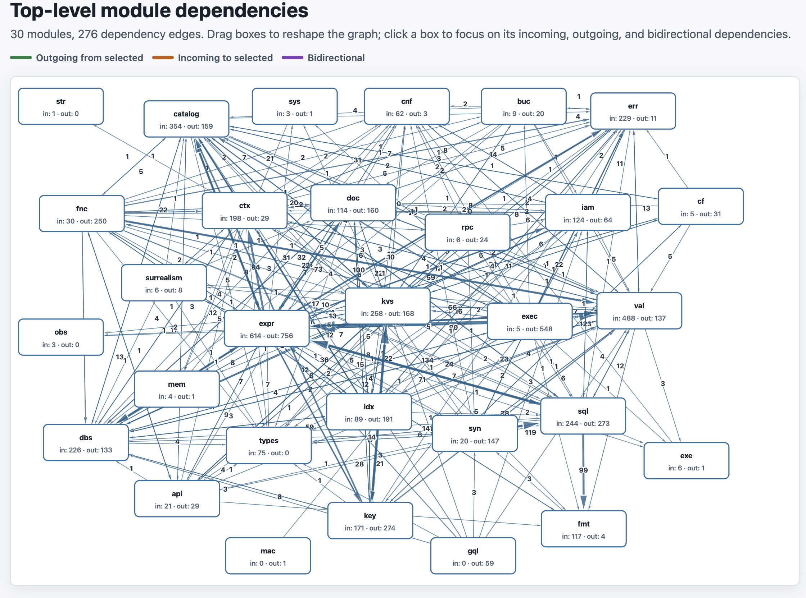

# dep-analysis

`dep-analysis` is a small Rust dependency exploration tool.

It parses a Rust entry file, recursively follows `mod` declarations, and writes JSON records showing which internal modules reference which other internal modules. It can then turn those records into a self-contained interactive HTML page that shows top-level module dependencies as boxes and arrows.



## Usage

Analyse a Rust file and write internal module dependencies as JSON:

```sh
cargo run -- analyse path/to/lib.rs -o dependencies.json
```

Visualise that JSON as an HTML graph:

```sh
cargo run -- visualise dependencies.json -o dependencies.html
```

For `analyse`, omitting `-o` writes JSON to stdout. For `visualise`, omitting `-o` writes the HTML to a temporary file and opens it with `open`.

## Output

The `analyse` command writes records with the source file, first line number, source module, and target module:

```json
[
  {
    "file": "path/to/module.rs",
    "line": 42,
    "from_module": "crate::api",
    "to_module": "crate::db"
  }
]
```

The `visualise` command collapses those records to top-level modules and renders an interactive SVG graph. You can drag boxes, toggle a module to focus its incoming and outgoing edges, and use the generated page without a server.
